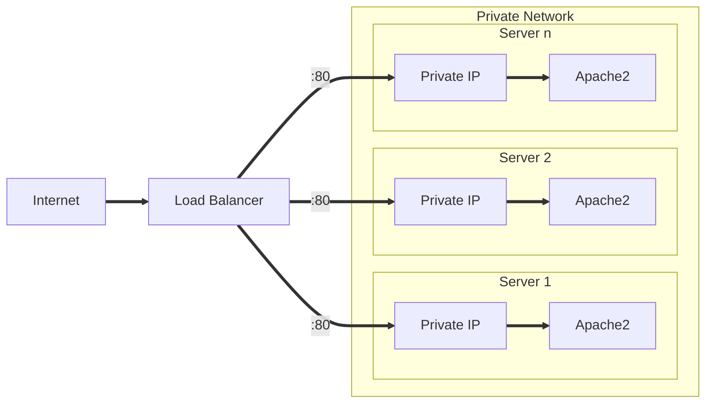
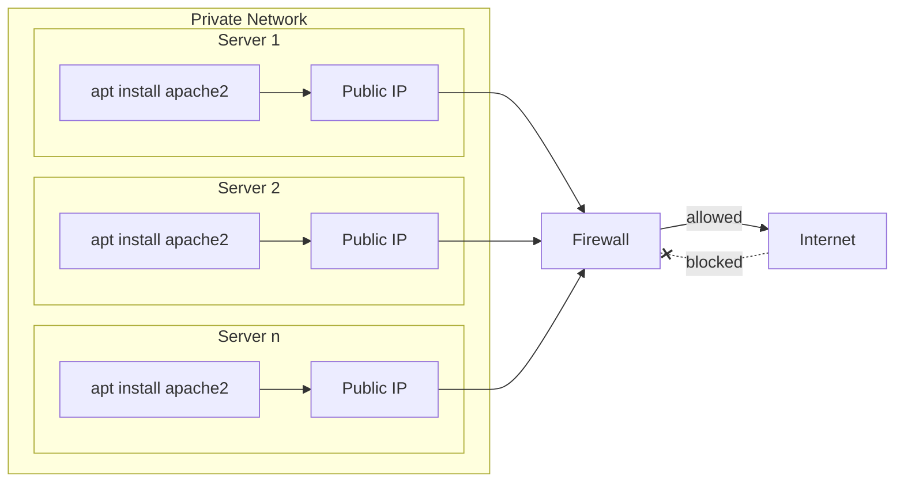

# Simple Example of a LoadBalancer and Webservers

Deploys a level-4 loadbalancer with several webservers as targets.
Accessing the public IP of the LB in the browser shows a website served from different backend servers and their IPs.  

1. Deploy via:

    ```bash
    export HCLOUD_TOKEN=... # generated via webui in hetzner project
    terraform apply -var "hcloud_token=$HCLOUD_TOKEN"
    ```

2. Get the public IP-Address of the Loadbalancer and paste it into your browser.
    (Ensure using _http://_ and not _https://_)
3. Keep refreshing the page and observer the different hostnames :)
4. After you're done playing around
   1. Destroy the resources via `terraform destroy -var "hcloud_token=$HCLOUD_TOKEN"`
   2. Delete the API Key from your Hetzner Cloud Project

## Architecture



---


